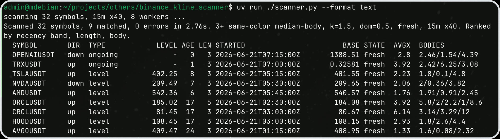

# binance-kline-scanner

[](https://github.com/asidko/binance-kline-scanner/actions/workflows/ci.yml)
[](https://github.com/asidko/binance-kline-scanner/releases/latest)
[](LICENSE)



Screen Binance USD-M futures for fresh impulse setups - runs of N consecutive
same-color "large" candles - ranked best-first. `bks` fetches every symbol on
your list in parallel and prints the cleanest setups first.

## Install

Prebuilt single-file binary (Linux / macOS, x86_64 / arm64), no Python needed:

```
curl -fsSL https://raw.githubusercontent.com/asidko/binance-kline-scanner/main/install.sh | sh
```

Installs `bks` to `~/.local/bin`. Uninstall:

```
curl -fsSL https://raw.githubusercontent.com/asidko/binance-kline-scanner/main/install.sh | sh -s -- --remove
```

Or grab a binary straight from the [latest release](https://github.com/asidko/binance-kline-scanner/releases/latest) and `chmod +x`.

## Use

```
bks                                          # scan the bundled list, ranked table
bks --direction down                         # only bearish impulses
bks --include-stale                          # also show already-broken runs
bks --type ongoing                           # only still-moving (level = already reacted)
bks --symbols SOLUSDT,XRPUSDT --count 3 --k 2
bks --symbols-file my_list.txt --interval 1h --workers 12
bks --format json                            # machine-readable, full precision
```

A "run" is N+ consecutive candles of one color, each with a body at least `K x`
the window's typical body (`median-body` default, `atr` optional). The scanner
keeps only **fresh** runs by default - those no later candle has closed back
into - and ranks matches by recency band, then longest run, then biggest bodies.
The still-forming last candle is dropped, so runs and levels never shift
mid-candle.

Each match carries direction, type (`ongoing` = still one color after / `level`
= a red and a green reacted after, with the consolidation break level), age,
length, `started_at` (UTC open time of the first candle - with length x interval
that gives the exact range), the origin extreme, a fresh flag, and body
multiples. Exit codes: `0` matched, `1` none, `2` error (`--exit-zero` to always
exit 0).

Symbols come from `--symbols` (comma list) or `--symbols-file` (one per line,
`#` comments, inline comments allowed). With neither, `bks` uses
`~/.config/bks/scan_symbols.txt`, which it auto-creates from the bundled list on
first run so you can edit what scans (override the dir with `BKS_CONFIG_DIR`).

## Symbols

The bundled default list ships two groups, both editable in
`~/.config/bks/scan_symbols.txt`:

- Crypto: liquid established USD-M perps (no BTC/ETH, no microcap memes).
- TradFi / pre-IPO equity perps (Binance `TRADIFI_PERPETUAL`): SPCXUSDT (SpaceX),
  OPENAIUSDT, TSLAUSDT, NVDAUSDT, AAPLUSDT and other popular names.

## Develop / build from source

Run from source with [uv](https://docs.astral.sh/uv/) (stdlib only, no runtime
deps; the detector also runs as plain `python3`):

```
uv sync
uv run ./scanner.py --format text
cat window.json | ./klines_seq_detector.py --direction down --fresh --format text
```

Tests (synthetic, no network):

```
uv run python test_klines_seq_detector.py
uv run python test_scanner.py
```

Build the portable binary (pinned to Python 3.13; flags live in
`# nuitka-project:` comments in `scanner.py`):

```
uv run python build.py     # -> dist/bks-<os>-<arch>
```

Releases are built per-OS by `.github/workflows/release.yml` on a `v*` tag.

## How it works

Two pieces, wired by import:

- `klines_seq_detector.py` - the pure detector. An OHLC window in (JSON on
  stdin), a verdict out (JSON or text). Symbol/exchange/time agnostic - just
  candle math. Usable standalone or imported.
- `scanner.py` - fetches the last N klines per symbol from Binance in a bounded,
  jittered thread pool (fast but not hammering the API), runs the detector on
  each, ranks, and renders. `bks` is this script compiled to a single binary.

## Notes

- Read-only REST polling against `fapi.binance.com`. The pool is bounded
  (default 8, capped 32) and jittered; 418/429/network errors back off and
  retry. Per-symbol failures are isolated and reported, never fatal to the scan.
- "large" is measured against the scanned window itself, so it adapts per symbol
  and per regime.

## License

MIT - see [LICENSE](LICENSE).
