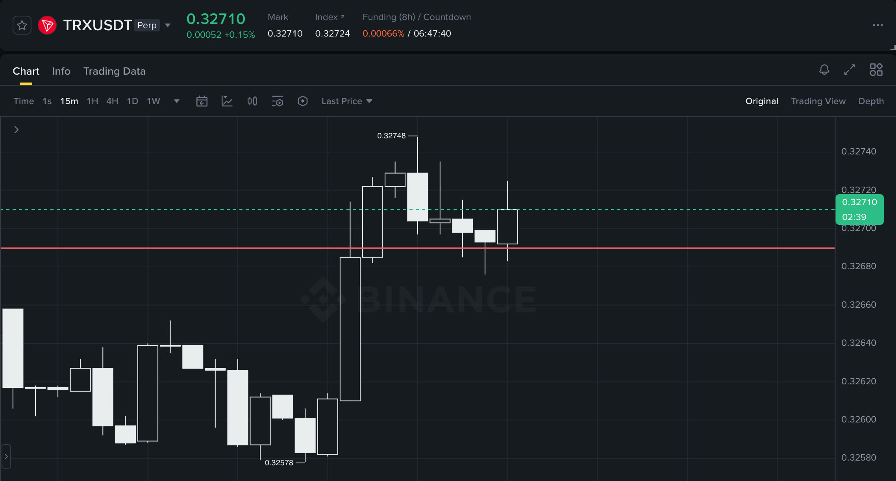

# binance-kline-scanner

[](https://github.com/asidko/binance-kline-scanner/actions/workflows/ci.yml)
[](https://github.com/asidko/binance-kline-scanner/releases/latest)
[](LICENSE)


Screen Binance USD-M futures for fresh impulse setups - runs of N consecutive
same-color "large" candles, ranked best-first. It flags where price ran hard,
then stalled into a level it has to break - and computes that level for you.
`bks` scans your whole watchlist in parallel.



*`bks` looks for setups like this: a burst of large candles, then a tight
consolidation - it finds them and marks the break level (red) price coils against.*

## Install

Prebuilt single-file binary (Linux / macOS, x86_64 / arm64), no Python needed:

```
curl -fsSL https://raw.githubusercontent.com/asidko/binance-kline-scanner/main/install.sh | sh
```

This drops `bks` into `~/.local/bin`. To uninstall, run the same line with
`--remove` appended:

```
curl -fsSL https://raw.githubusercontent.com/asidko/binance-kline-scanner/main/install.sh | sh -s -- --remove
```

Prefer to do it by hand? Download a binary from the
[latest release](https://github.com/asidko/binance-kline-scanner/releases/latest)
and `chmod +x` it.

## Use

```
bks
```

Scans your watchlist on the 15m timeframe and prints the strongest setups first.
Symbols come from `~/.config/bks/scan_symbols.txt`, created from a default list
on first run - edit it to choose what scans.

More:

```
bks --direction down             # bearish impulses only
bks --type ongoing               # still-running moves (skip ones price already reacted to)
bks --include-stale              # also show runs price has closed back into
bks --symbols SOLUSDT,XRPUSDT    # these symbols instead of the watchlist
bks --count 4 --k 2              # stricter: 4+ candles, bigger-than-usual bodies
bks --interval 1h                # a different timeframe (default 15m)
bks --format json                # machine-readable, for piping into other tools
```

A run is N+ consecutive same-color candles whose bodies beat the window's
typical body. Fresh runs (no later candle has closed back into them) rank first,
then by length, then body size. The still-forming candle is dropped, so results
never shift mid-candle.

Each row shows direction, type (`ongoing`, or `level` with the price it reacted
at), age, length, start time, a fresh flag, and body sizes. Exit code: `0`
matched, `1` none, `2` error.

## Symbols

The default watchlist is liquid crypto alts plus TradFi / pre-IPO equity perps
(TSLA, NVDA, SpaceX, OpenAI, ...). Edit `~/.config/bks/scan_symbols.txt` to change
it, or override the dir with `BKS_CONFIG_DIR`.

## Telegram alerts

Want a ping when price reaches a level? Install
[binance-futures-monitor](https://github.com/asidko/binance-futures-monitor)
(`bfm`), then turn the levels `bks` finds into alerts:

```
bks --type level --format json | jq -r '.results[] | "--symbol \(.symbol) --level \(.runs[0].level)"' | xargs -L1 bfm add
```

`bfm` pings you (Telegram, etc.) when price hits any of them.

## How it works

Two pieces, wired by import:

- `klines_seq_detector.py` - the pure detector: an OHLC window in, a verdict out.
  No network, no symbols; importable or runnable standalone.
- `scanner.py` - read-only fetch of klines per symbol from Binance in a bounded,
  jittered thread pool, runs the detector, ranks, renders. This is the `bks` binary.

## Build from source

```
uv sync
uv run ./scanner.py                                  # run without installing
uv run python build.py                               # build the bks binary
uv run python test_scanner.py                        # tests (no network)
```

## License

MIT - see [LICENSE](LICENSE).
